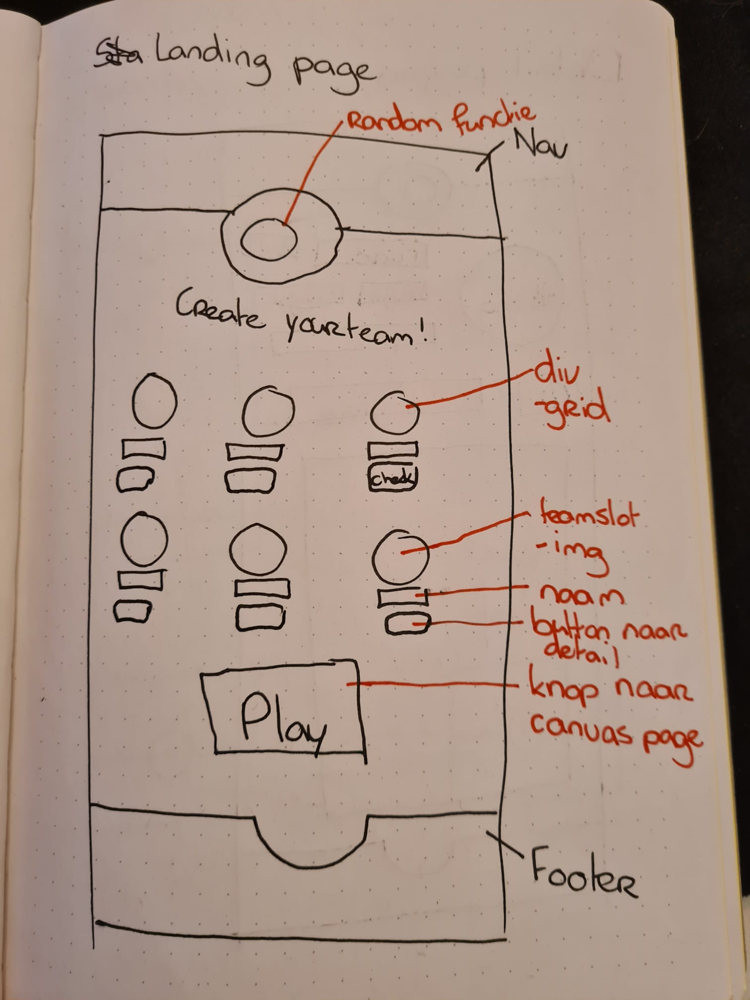
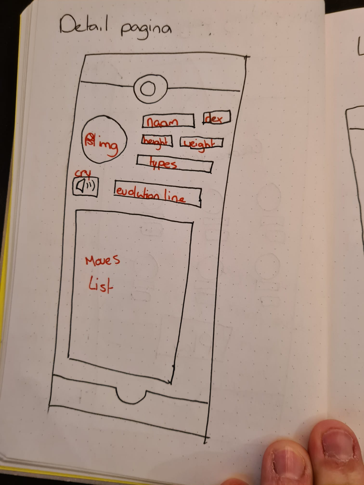
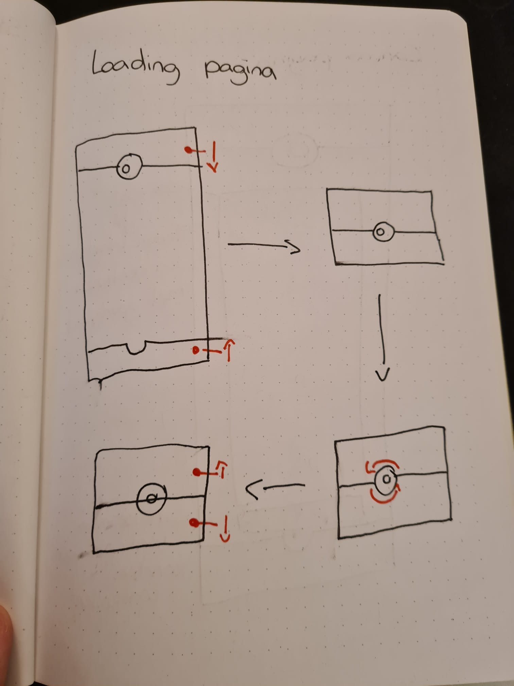
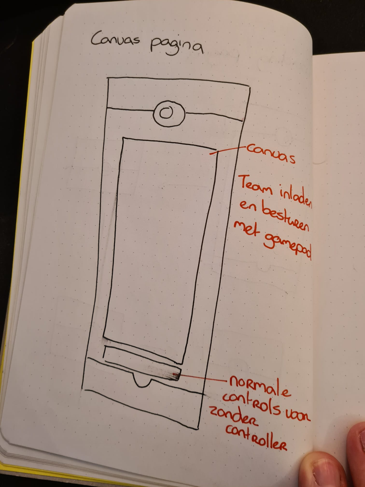
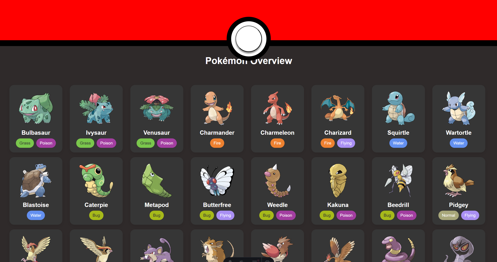
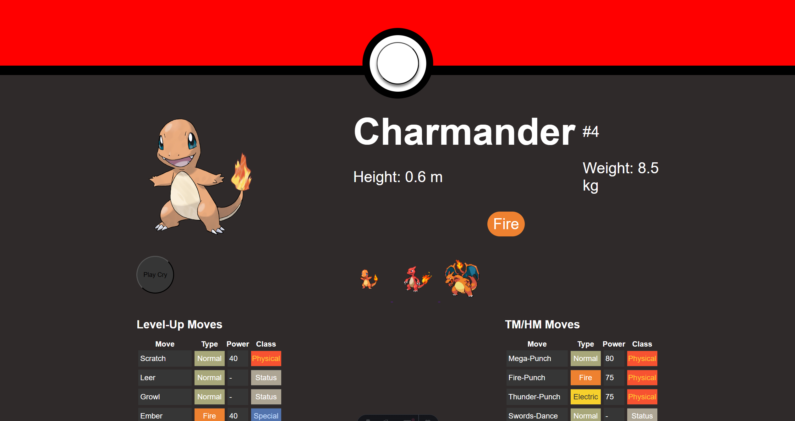
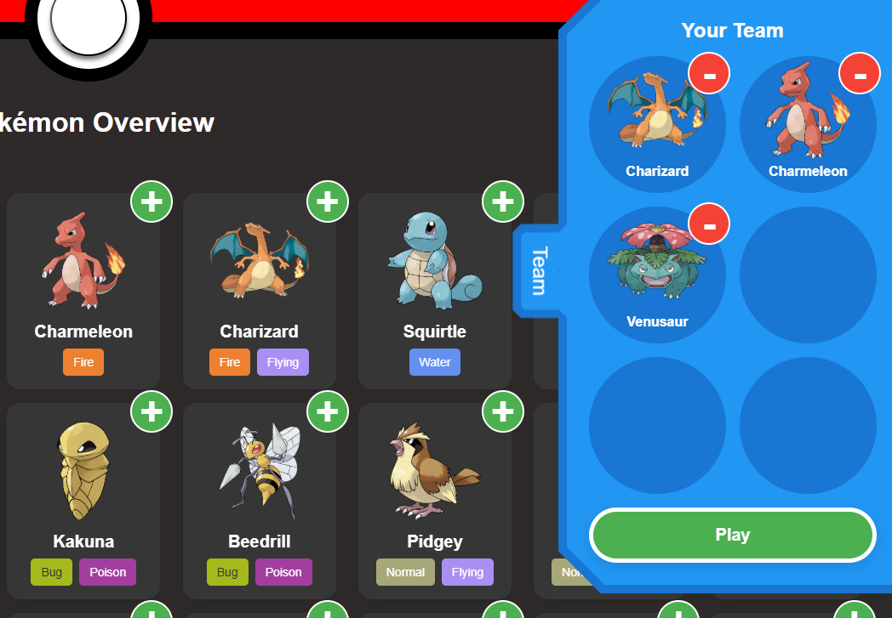
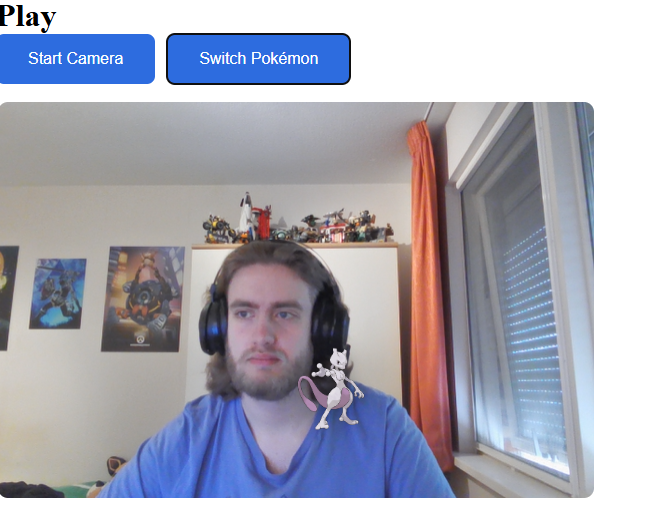

# Melvin-Web_API

## Week 1

### Dag 1: Woensdag 1 - 4 - 2026
Vandaag was eerste dag van het nieuwe project API. we begonnen klassikaal met een college waarna we in groepjes op zoek gingen naar API's. Ik was er eigenlijk al vrij zeker van op moment dat ik iets wilde gaan doen met games. Dat geeft me namelijk altijd meer motivatie om aan de opdracht te werken. Zo leek het me ook leuk om te gaan kijken naar de web GamePad API. Ik heb tenslotte genoeg controllers om uit te kiezen. Tijdens de workshop van Astro liep ik tegen een paar dingetjes op waar ik niet per se zelf heel veel aan kon doen, maar ze wel op heb weten te lossen. Zo had ik mijn mapje opgeslagen in een mapje met een & teken erin, dat vond de terminal niet zo leuk.   
Voor mijn idee voor de opdracht wilde ik iets gaan doen met de pokémon APIm, ook weer voor meer motivatie en een cooler project daardoor. Mijn idee was dat je op de landingspagina een team kan samenstellen en dat je dan per pokemon ook details kan bekijken. Op die manier voldoe ik dan namelijk al aan een overview en een detailpagina. Maar ik moest nog iets met 2 web API's, Het idee was dat je dan met je gemaakte team kon spelen op een canvas en ze kon besturen met een controller. Het klonk persoonlijk nog niet heel vet. Ik had heb even met Jad overlegd en later ook met Cyd erbij. We kwamen tot het idee om iets te gaan proberen met AR. Als dat zou lukken zou dat heel vet zijn, ik hoop dat het lukt. Het nieuwe AR idee had ik nog niet op papier uitgewerkt, maar alle schetsen die ik had staan hieronder.






#### Checkout met Dylan
Ik heb mijn checkout met Dylan online gedaan, omdat ik wat eerder naar huis ging vanwege mijn verkoudheid. Ik kon Dylan nog even helpen met het setuppen van Astro en heb mijn idee uitgelegd wat ik tot nu toe had. Zelf had hij op dat moment nog geen idee voor zijn opdracht.

### Weekverslag
Deze week zijn we begonnen met het API project. Deze week was een beetje kort, hierdoor is er niet heel veel gebeurt. Ik heb deze week een workshop over Astro gevolgd om dat een beetje te leren kennen. Tijdens de workshop waren er een paar problemen, maar die kreeg ik na die tijd opgelost. Ook heb ik een beetje onderzoek gedaan naar verschillende Content en Web API's. Ik ben uitgekomen dat ik iets wil doen met de Pokémon API, omdat dat me veel motivatie geeft. Verder wil ik iets doen met de GamePad en Canvas API's. Gewoon om het zo gamy mogelijk te maken. Als eerste idee had ik dat je een team kon samenstellen en dan met dat een beetje kon spelen / rondlopen op het canvas. Maar dat was nog een beetje simpel. Cyd en Jad hadden geholpen met een ander idee en dat was iets doen met AR. Ik zie nog niet helemaal voor me hoe ik dat ga doen, maar dan komt dan later nog wel. Ik wil wel nog steeeds iets doen met die GamePad API.

### Voortgangsgesprek
Ik had mijn idee gepitched over dat ik iets met AR wilde gaan proberen. Iedereen vond dit eigenlijk wel een heel leuk idee, zelf heb ik dat uiteraard ook. Het gaat alleen wel echt een uitdaging worden om het werken te krijgen. Cyd had ook nog gezegd dat als de AR web API al zou werken, ik misschien niet eens een tweede web API nodig heb. Maar zelf denk ik dat het er vanzelf wel meer worden in de vorm van bijvoorbeeld localstorage of iets dergelijks. Cyd wil in ieder geval een Mewtwo op de ene schouder en een Squirtle op de andere.

### Bekeken bronnen van deze week
https://ar-js-org.github.io/AR.js-Docs/<br>
https://stackblitz.com/edit/pokemon-api?file=index.js<br>
https://developer.mozilla.org/en-US/docs/Web/API/WebXR_Device_API<br>

## Week 2
### Dag 2: Woensdag 8 - 4 - 2026
Beginnen met workshop
Begin gemaakt aan de overview pagina

Vandaag begonnen we met het echt maken van de website. Beginnend met een workshop over Astro. Deze was wel heel handig, heel veel informatie daaruit kon ik daarna namelijk gebruiken voor mijn eigen website. Ik ben vandaag namelijk begonnen met het setuppen van mijn overview pagina. Dit kreeg ik redelijk snel aan de praat. Met de styling ben ik ook al een flink uit gekomen, het is soms alleen nog een beetje onoverzichtelijk in de opbouw van mijn code. Ik had dus ook Jad nog even gevraagd of hij er nog even naar kon kijken. Nu is mijn opbouw in ieder geval goed en kan ik dat aanhouden voor de rest van mijn website. Voor de typings van de pokémon wilde ik de kleuren van de typing gebruiken zoals ze in pokemon zijn. Dit heb ik aan ChatGPT gevraagd. De code die daaruit kwam staat hieronder. Dit was voornamelijk voor de verschillende kleuren, die heb ik later opgeslagen in mijn :root zodat ik ze voor andere styling op de detailpagina ook meteen kan gebruiken.



#### ChatGPT code
Prompt: Could you give me different styling for each typing? So that the background color is different?
```
<div class="types">
  {pokemon.types.map((typeObj) => (
    <span class={`type type-${typeObj.type.name}`}>
      {typeObj.type.name}
    </span>
  ))}
</div>
```
```
/* Type-based colors */
.type-normal { background: #A8A77A; color: #fff; }
.type-fire { background: #EE8130; color: #fff; }
.type-water { background: #6390F0; color: #fff; }
.type-electric { background: #F7D02C; color: #333; }
.type-grass { background: #7AC74C; color: #333; }
.type-ice { background: #96D9D6; color: #333; }
.type-fighting { background: #C22E28; color: #fff; }
.type-poison { background: #A33EA1; color: #fff; }
.type-ground { background: #E2BF65; color: #333; }
.type-flying { background: #A98FF3; color: #fff; }
.type-psychic { background: #F95587; color: #fff; }
.type-bug { background: #A6B91A; color: #333; }
.type-rock { background: #B6A136; color: #fff; }
.type-ghost { background: #735797; color: #fff; }
.type-dragon { background: #6F35FC; color: #fff; }
.type-dark { background: #705746; color: #fff; }
.type-steel { background: #B7B7CE; color: #333; }
.type-fairy { background: #D685AD; color: #fff; }
```

#### Bekeken bronnen
https://fonts.google.com/specimen/Jost

#### Checkout met Mats en Choice
Vandaag hadden we met zijn 3en de checkout gedaan omdat we allemaal geen partner hadden. Er is deze keer niet veel gebeurt. We hebben gewoon onze ideeën aan elkaar verteld, maar er is zijn niet veel nieuwe dingen uit ontstaan.


### Dag 3: Donderdag 9 - 4 - 2026
Vandaag ben ik voornamelijk bezig geweest met de detailpagina. Het was een beetje gedoe om de juiste informatie uit de API te halen, later had ik ook nog extra data eruit te halen van welke TM en HM Pokémon kunnen leren, want ik had nog ruimte over op mijn pagina. Ook heb ik vandaag extra focus proberen te leggen op het DRY maken van mijn code. Zo had ik namelijk 2 verschillende layouts die hetzelfde waren. Maar ik probeerde er ook op te letten dat ik niet in CSS te veel mezelf aan het herhalen was door onderdelen in de global.css te zetten. Ik heb nog wel ideeën voor op mijn detailpagina, zoals knoppen links en rechtsboven om naar de volgende en vorige in de pokedex te gaan. Maar voor volgende keer lijkt het me handiger om te gaan beginnen aan de eisen die echt moeten voor de opdracht, zoals het gebruik van verschillende content API's. Dylan had vandaag ook nog geholpen met dat ik de API maar op 1 locatie ophaal, dat is namelijk ook weer voor DRY, maar ook dat het makkelijker aanpassen is als ik de hoeveelheid opgehaalde Pokémon ik wil ophalen.

 

#### Checkout met Louise
Louise doet iets met de spotify API, ze maakt een website waarmee je makkelijk nummers kan toevoegen en verwijderen. Voor nu heeft ze alleen een overview pagina, dat was al lastig genoeg omdat ze er ook vaak automatisch eruit wordt gegooid. Volgende week wilt ze bezig met detailpagina's van de verschillende nummers. Zelf heb had ik vandaag een detailpagina gemaakt, ik ben nog niet helemaal tevreden over de styling. Maar zelf wil ik volgende week een begin maken aan het maken van een teatm, en aan de hand van hoelang dat duurt wil ik misschien ook al een begin maken aan de AR functionaliteit.

### Weekverslag
Deze week ben ik begonnen met het echt maken van mijn project. Ik wil iets gaan doen met de Pokémon API. Ik heb hiervoor nu al in ieder geval een overviewpagina en heb een goed begin aan de detail pagina. Er is nog wel meer informatie die ik eventueel zou kunnen laten zien, maar is niet per se nodig. Ook ben ik nog niet tevreden over de styling op mijn detailpagina. Dylan had me een beetje geholpen met het opzetten van mijn detailpagina zodat de routing goed werkt. Hij had dit namelijk eerder al klaar dan ik. In de komende weken wil ik dit project nog uitbreiden door de functionaliteit toe te voegen dat je een team kan samenstellen en dat dit dan eventueel wordt opgeslagen in de localstorage. Maar dat is niet het hoofddoel van mijn project. Ik wil namelijk iets met AR gaan doen. Dit is iets wat ik nog niet eerder met HTML, CSS en Javascript heb gemaakt, dus het zal een flinke uitdaging worden. Tussendoor kreeg ik ook nog het idee om misschien iets te combineren met de Pokémon Trading Card Game API, misschien dat ik die kan gebruiken in combinatie met AR als gezichtsherkenning niet wilt werken. Dat ik dan bijvoorbeeld kaarten gebruik op Pokémon op te zetten in plaats van op je schouder. Maar dat zien we in de komende weken dan wel.

### Voortgangsgesprek
- Al goed op weg, maar de moneyshot moet nog komen
- Volgende stap is inderdaad handiger om eerst te kijken naar web API's in plaats te veel focus op styling, ook al heeft styling wel nog aandacht nodig
- Misschien de centrale knop bovenin gebruiken om AR te triggeren?
- De styling van de hover op overview aanpassen zodat het iets creatiever is? Achtergrond aanpassen naar een pokeball? Niet alleen het plaatje scalen
- Leuk idee om verschillende effecten te hebben wanneer een pokemon uit de het team in AR te zien komt.
- De typings minder laten lijken alsof het knoppen zijn, minder pil vorm
- Misschien een filter systeem op de overview pagina, per typing of per generatie.
- Skeleton loading

## Week 3
### Dag 4: Woensdag 15 - 4 - 2026
Vandaag werkte ik weer vanuit huis, het was namelijk niet echt duidelijk hoe de les vandaag er uit zou gaan zien en op Teams in de planning was er niks te vinden over deze week. Ik heb gewerkt aan het maken van een team op de website. Ik begon door elke card van een pokemon op de overview pagina een plus button te geven. Daarna werkte ik aan het maken van een zijpaneel waar je je team kon zien. Het duurde niet lang voordat ik werkend kreeg dat je de pokemons daar aan toe kon voegen. Localstorage was niet lastig om hier aan toe te voegen, daar had ik namelijk wel eens eerder al mee gewerkt. De styling ben ik hier wel zeer tevreden over, het duurde even voordat ik het goed kreeg dat de plaatjes en teksten niet meer ruimte innamen dan gegeven is, maar het werkt nu goed.

Daarna heb ik geprobeerd om AI te laten werken. Ik had online iets gevonden over WebXR, maar ik zag ook dat het maar beperkt beschikbaar was voor sommige browser en dat het vooral gefocust was op mobiel. Ik had ChatGPT even snel iets laten maken, maar kwam er toen al snel achter dat het niet zou werken voor Chrome, de browser die ik gebruik. Daarna was ik iets maar gewoon begonnen met het werkend krijgen van de camera, deed lukte snel. Daarna had ik geprobeerd om er een overlay overheen te zetten. Dit werkte wel redelijk voor het plaatsen van pokémon maar ik wist nog niet hoe ik het werkend ging krijgen dat het echt aan de hand van de camera ging. ChatGPT had hier een oplossing voor. Alleen is het dan met een library in plaats van een API, wat volgens mij niet volgens de opdracht regels is. Ik zal dit morgen aan Cyd op school vragen en laten zien wat ik tot nu toe heb. Ik had nog kort geprobeerd om de battle sprite te gebruiken voor AR maar heb dat voor nu laten zitten.

#### Hulp van ChatGPT
Prompt: Right it just places the pokemon sprite on the video overlay, but it is not according to the user on the camera. Do you have an Web API that can make that happen? Give me the full script

```
---
  <!-- ✅ MediaPipe -->
  <script src="https://cdn.jsdelivr.net/npm/@mediapipe/face_detection/face_detection.js"></script>
  <script src="https://cdn.jsdelivr.net/npm/@mediapipe/camera_utils/camera_utils.js"></script>

  <script>
    // @ts-nocheck

    const btn = document.getElementById("start-camera");
    const video = document.getElementById("video");

    const pokemon = document.getElementById("pokemon");
    const switchBtn = document.getElementById("switch");

    // 🎮 Load team
    let team = [];
    let selected = 0;

    try {
      const savedTeam = localStorage.getItem("pokemon-team");
      if (savedTeam) {
        const parsed = JSON.parse(savedTeam);
        if (Array.isArray(parsed) && parsed.length === 6) {
          team = parsed;
        }
      }
    } catch (e) {
      console.error("Failed to load team:", e);
    }

    function getValidTeam() {
      return (team || []).filter(p => p && typeof p === "object");
    }

    function setPokemonImage() {
      const validTeam = getValidTeam();

      if (validTeam.length === 0) {
        pokemon.style.display = "none";
        return;
      }

      if (selected >= validTeam.length) selected = 0;

      const current = validTeam[selected];

      pokemon.style.display = "block";
      pokemon.src = current.sprite || current.image;
    }

    // 🔁 Switch Pokémon
    switchBtn?.addEventListener("click", () => {
      const validTeam = getValidTeam();
      if (validTeam.length === 0) return;

      selected = (selected + 1) % validTeam.length;
      setPokemonImage();
    });

    // 🧠 Face detection setup
    const faceDetection = new FaceDetection({
      locateFile: (file) =>
        `https://cdn.jsdelivr.net/npm/@mediapipe/face_detection/${file}`,
    });

    faceDetection.setOptions({
      model: "short",
      minDetectionConfidence: 0.5,
    });

    // 🎯 Track face → position Pokémon
    faceDetection.onResults((results) => {
      if (!results.detections.length) return;

      const detection = results.detections[0];
      const box = detection.boundingBox;

      const x = box.xCenter;
      const y = box.yCenter;

      // Convert to %
      const left = x * 100;
      const top = y * 100;

      // 👉 Shoulder offset (tweak if needed)
      pokemon.style.left = `${left + 10}%`;
      pokemon.style.top = `${top + 12}%`;
    });

    // 📷 Start camera + tracking
    btn?.addEventListener("click", async () => {
      try {
        const stream = await navigator.mediaDevices.getUserMedia({
          video: true,
          audio: false,
        });

        video.srcObject = stream;
        await video.play();

        // 🚀 Start MediaPipe camera loop
        const camera = new Camera(video, {
          onFrame: async () => {
            await faceDetection.send({ image: video });
          },
          width: 600,
          height: 400,
        });

        camera.start();
      } catch (err) {
        console.error(err);
        alert("Camera access denied or not available.");
      }
    });

    // 🚀 Init
    setPokemonImage();
  </script>
</DefaultLayout>
```




#### Checkout met Dylan
Ik wist dat Dylan vandaag ook thuis was, dus hadden we even aan elkaar laten zien wat we tot nu toe hebben. Onze projecten beginnen nu wel echt uiteen te lopen. Dylan heeft namelijk nu op een canvas al een gebied waarin je kan rond lopen en heeft al een speler met verschillende loop sprites.

### Dag 5: Donderdag 16 - 4 - 2025
Vandaag werkte ik weer op school, had meteen aan Cyd gevraagd om te vragen of het goed was dat ik library gebruikte voor AR ipv een API. Ze had nog even meegekeken maar stelde voor om ook aan Jad te vragen. Die kwam tot dezelfde conclusies. Ik kan verder met waar ik nu mee bezig was. Daarna heb ik mijn font werkend gekregen door hem uberhaupt aan het project toe te voegen, heb ik icons toegevoegd voor + en - die ik van fontawesome heb gehaald. Heb ik wat styling gedaan op de AR pagina, en heb Cyd nog even om ideeën gevraagd. Zij stelde voor om het even uit te schetsen. Daarbuiten heb ik mijn home knop ook nog werkend gemaakt en heb ik geprobeerd met de AR te spelen door de pokemon kleiner te maken als het gezicht kleiner is en de afstand tot schouder kleiner te maken zodat ze niet zweven. Daar had ik een begin voor, maar nog niet compleet perfect werkend.